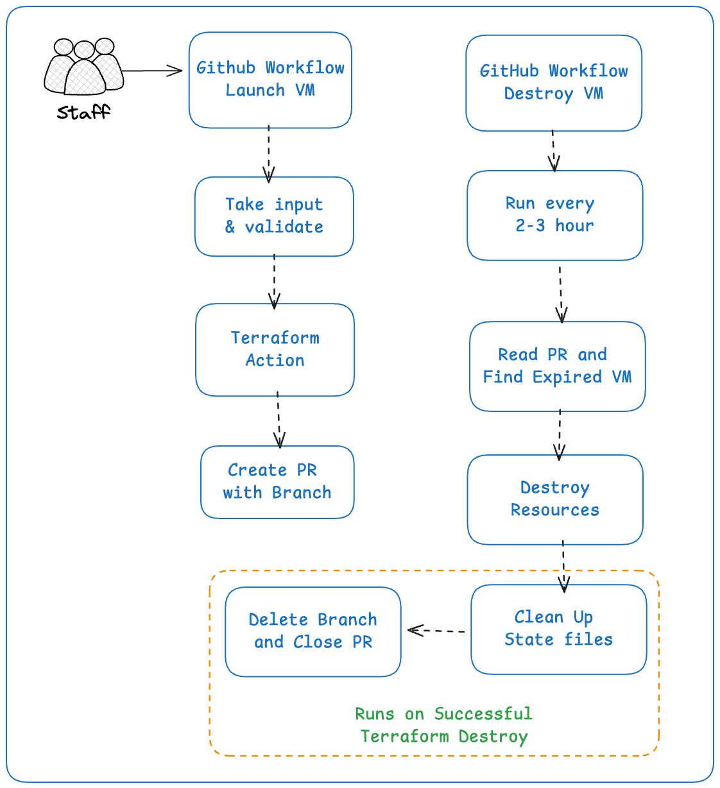

# Multi-Cloud VM Provisioning with Azure DevOps Agents

> **One-click cloud infrastructure provisioning** with automated Azure DevOps self-hosted agents, DNS integration, and cost-controlled resource management.

Terraform configurations for provisioning VMs across AWS and GCP with pre-configured Azure DevOps self-hosted agents and automatic Cloudflare DNS integration.

## 🏗️ Architecture



- **VM**: Cloud instance with encrypted storage
- **Agent**: Azure DevOps self-hosted agent with pre-installed tools
- **DNS**: Cloudflare A record pointing to VM public IP
- **State**: Remote Terraform state stored in S3

## ✨ Features

- 🌐 **Multi-cloud support**: AWS EC2 and GCP Compute Engine
- 🤖 **Automated agent setup**: Azure DevOps self-hosted agents with pre-installed tools
- 🔗 **DNS integration**: Automatic Cloudflare DNS record creation
- 🔒 **Security**: Encrypted storage, SSH key management, IAM controls
- 🛠️ **Tool installation**: Python, Ansible, Terraform, AWS CLI, and more
- ⏰ **Auto-expiry**: Cost control with automatic resource cleanup
- 📊 **PR tracking**: Visibility into active resources

## 📋 Prerequisites

- Terraform >= 1.5.0
- AWS CLI configured (for AWS deployment)
- GCP credentials configured (for GCP deployment)
- Cloudflare API token with DNS permissions
- SSH key pair
- Azure DevOps organization and Personal Access Token (PAT)

## 🚀 Action Usage

1. Go to **Actions** → **"Create Virtual Machine"**
2. Configure your options:
   - Cloud provider (AWS/GCP)
   - Instance size (micro to xlarge)
   - Duration (1-72 hours)
   - Region (Singapore, US-East, Europe)
3. Click **"Run workflow"**
4. Monitor progress via automatically created PR

## ⚙️ Configuration

### Required Variables

| Variable | Description | Example |
|----------|-------------|---------|
| `orgURL` | Azure DevOps organization URL | `https://dev.azure.com/myorg` |
| `personal_access_token` | Azure DevOps PAT with Agent Pool permissions | `your_pat_token` |
| `agent_pool_name` | Target agent pool name | `default` |
| `key_name` | SSH key identifier | `my-key` |

### Optional Variables

| Variable | AWS Default | GCP Default | Description |
|----------|-------------|-------------|-------------|
| `region` | `ap-southeast-1` | `us-central1` | Cloud region |
| `instance_type` | `t2.small` | `e2-small` | Instance size |
| `disk_size` | `10` | `10` | Root disk size (GB) |
| `ssh_public_key_path` | `~/.ssh/id_rsa.pub` | `~/.ssh/id_rsa.pub` | SSH public key path |

## 📤 Outputs

After successful deployment:

```json
{
  "region": "ap-southeast-1",
  "instance_type": "t2.small",
  "public_ip": "54.169.xxx.xxx",
  "private_ip": "172.31.xxx.xxx",
  "command_to_connect": "ssh ubuntu@54.169.xxx.xxx",
  "agent_name": "self-hosted-agent-happy-dog",
  "domain_name": "happy-dog.mhosen.com"
}
```

---

> **Made with ❤️ for efficient cloud operations**
